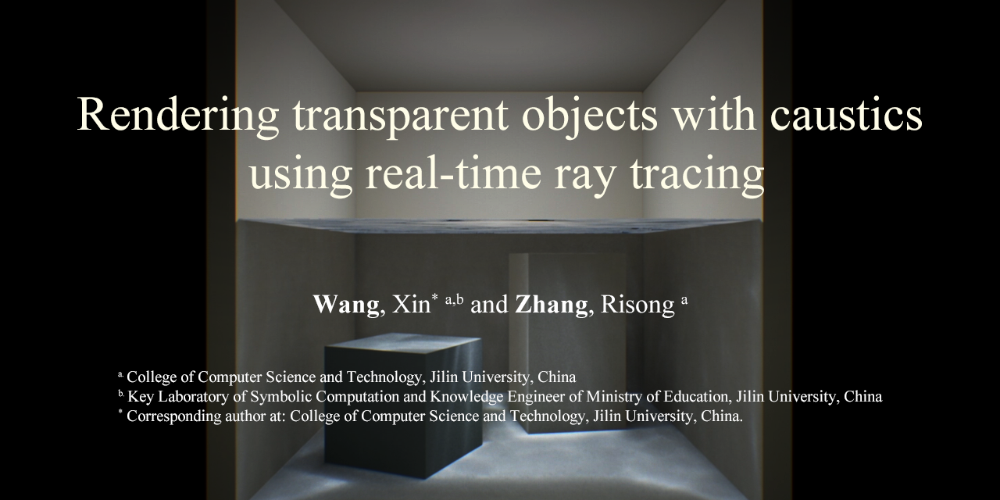
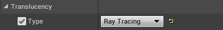
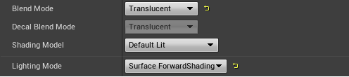
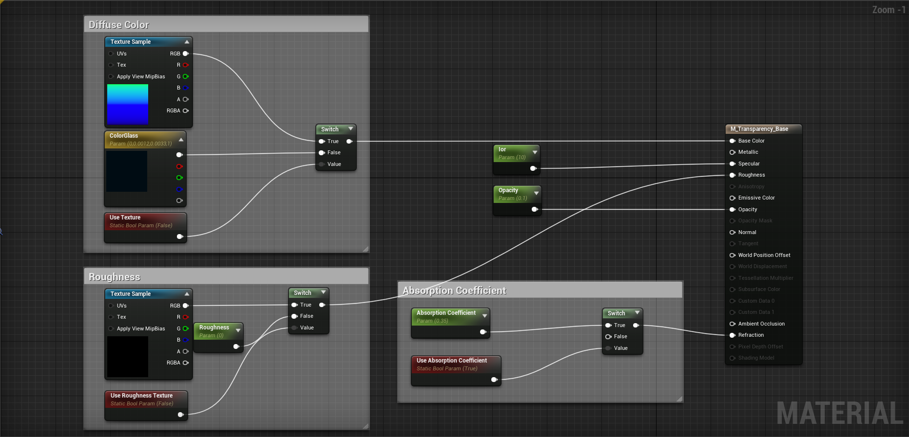

RTRT-Trans&Caustics
===

[英文版本](./README.md)|[日语版本](./ReadmeJP.md)(即将上线)



本工程是使用虚幻引擎4.25.1对于论文`Rendering Transparent Objects with Caustics using Real-Time Ray Tracing`<sup>[1]</sup>的实现参考。
论文中模拟了多种透明材质的光学现象，包括反射/折射、体积吸收、粗糙透明以及折射焦散，并将多种透明现象看为一个整体来处理，而不是独立地作为特效实现。
渲染结果中会带有些许噪声，我们将在未来工作中解决。

如果想要使用我们的工作，请引用我们的论文<sup>[1]</sup>。

[论文链接](https://www.sciencedirect.com/science/article/pii/S009784932100039X "中文版本将在知网可查。") | 
[50天免费链接](https://authors.elsevier.com/c/1csuo_2EOxPkV7)

安装
---

当前版本是基于虚幻引擎4.25.1版本实现的。
要使用当前实现，请事先从<https://github.com/EpicGames/UnrealEngine>下载虚幻引擎的完整源代码。

在完成源代码下载后, 将[Code](./Code)中所有的文件拖入源代码的根目录中。
你可能会遇到关于是否覆盖文件的询问，请为所有的文件选择`是`。

有关于如何编译和运行虚幻引擎，请参考[Epic Games的教程](https://github.com/EpicGames/UnrealEngine/blob/release/README.md).

下面展示了我们的实验环境：

| 软硬件 | 版本 |
| :----: | :----:|
| CPU | Intel® Core™ i9-10900K |
| GPU | Nvidia® RTX™ 2080 Ti |
| 内存 | 64GB |
| Visual Studio | 2019 16.7.2 |
| Windows 10 SDK | 10.0.18362.0 |
| Build Tools | MSVC v142 |
| 虚幻引擎 | 4.25.1 |

使用
---

### 在UE4中应用本文工作

将`Post Process Volume`拖入场景中，并将参数`Ray Tracing Translucency`设置为`Ray Tracing`。
请访问[这篇教程](https://docs.unrealengine.com/en-US/RenderingAndGraphics/RayTracing/RayTracingSettings/index.html)以查看更多关于在UE4中使用实施光线追踪的设置。



### 材质参数

每个透明材质的混合模式必须为`Translucent`，同时着色模式必须为`Default Lit`。
此外，要想使粗糙度可用，光照模型必须被设置为`Surface Forward Shading`。



我们引入了三个材质参数来控制渲染结果，包括`absorption coefficient`（吸收因子）、`roughness`（粗糙度）以及`opacity`（不透明度）。
此外，参数`refraction`（折射）控制透明材质的折射率。
这些参数如何影响渲染结果会在论文的补充材料中找到。



P.S. 我们提供了一个已经配置好并且带有多个示例场景的[示例工程](./Demo/Demoproject)

视频结果
---

[](https://www.bilibili.com/video/BV1Xy4y147tq "Video Result from Bilibili")

许可
---

本实现只适用于学术研究。如果要将此研究应用到任何商业活动中，请积极与我们联系。

未来工作
---
* 将工作转移到一个新的着色模式中，并且为蓝图中材质的根节点中的相应参数改名。
* 拓展LLT，并实现单条光线的多次交互, 类似Barré-Brisebois等人的工作<sup>[2]</sup>$。
* 设计一个去噪器以降低反射、粗糙透明以及折射焦散中的噪声。
* 修改LHPC中Pass的顺序，使得折射焦散在透过透明表面时可见，类似于欧阳和杨的工作<sup>[3]</sup>。

声明
---

本工作受到中国自然科学基金[51627805]的支持。
我们感谢匿名的审稿人以及他们中肯且有帮助的意见。
我们还要感谢Hyuk Kim对于复现SSPM<sup>[4]</sup>时提供的帮助。
感谢虚幻引擎的初始内容提供的材质，以及_ArchViz_ Interior工程提供的苹果以及多面体的模型。
其他场景素材是从<https://aigei.com>（爱给网）购买获得的.

引用文献
---

```
[1] @article{XWRZ2021,
    title = {Rendering Transparent Objects with Caustics using Real-Time Ray Tracing},
    journal = {Computers & Graphics},
    volume = {96},
    pages = {36-47},
    year = {2021},
    doi = {10.1016/j.cag.2021.03.003},
    author = {Xin Wang and Risong Zhang}
    }
```

```
[2] @inbook{Barr2019,
	author={Barr{\'e}-Brisebois, Colin
	and Hal{\'e}n, Henrik
	and Wihlidal, Graham
	and Lauritzen, Andrew
	and Bekkers, Jasper
	and Stachowiak, Tomasz
	and Andersson, Johan},
	title={Hybrid Rendering for Real-Time Ray Tracing},
	bookTitle={RayTracing Gems: High-Quality and Real-Time Rendering with DXR and Other APIs},
	year={2019},
	pages={437-473}
    }
```

```
[3] @Misc{RTXGI2020,
	author = {Yaobin Ouyang and Xueqing Yang},
	title = {Generating Ray-Traced Caustic Effects in Unreal Engine 4, Part 1},
	date = {2020-12-08},
	url ={https://developer.nvidia.com/blog/generating-ray-traced-caustic-effects-in-unreal-engine-4-part-1/},
    }
```

```
[4] @inbook{Kim2019,
	author = {Kim, Hyuk},
	title = {Caustics Using Screen-Space Photon Mapping},
	bookTitle={Ray Tracing Gems: High-Quality and Real-Time Rendering with DXR and Other APIs},
	year={2019},
	pages = {543-555}
    }
```
